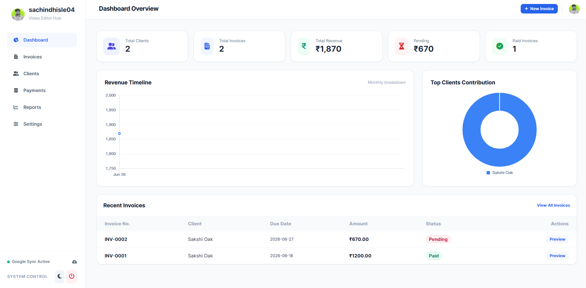

<div align="center">

# 💼 InvoicePro

### Modern Invoice & Client Management Dashboard

Create professional invoices, manage clients, track payments, monitor revenue, and generate business reports — all in one lightweight web application.


</div>

---

# 📖 About

InvoicePro is a modern business dashboard designed for freelancers, agencies, small businesses, and professionals.

Manage your clients, generate invoices, record payments, monitor revenue, and analyze business performance—all from one clean and responsive interface.

No spreadsheets.

No manual calculations.

Everything stays organized.

---

# ✨ Features

## 📄 Invoice Management

- Create Professional Invoices
- Invoice Preview
- Edit Invoice
- Delete Invoice
- Invoice Number Generator
- Due Date Management
- Payment Status
- Pending & Paid Tracking

---

## 👥 Client Management

- Add Unlimited Clients
- Edit Client Information
- Contact Details
- Client History
- Revenue by Client

---

## 💰 Payment Tracking

- Record Payments
- Pending Payments
- Paid Invoices
- Outstanding Balance
- Payment Timeline

---

## 📊 Business Dashboard

- Total Clients
- Total Revenue
- Pending Revenue
- Paid Revenue
- Revenue Timeline
- Monthly Analytics
- Client Contribution Chart

---

## 📈 Reports

- Revenue Reports
- Invoice Reports
- Payment Reports
- Client Reports
- Monthly Summary

---

## ☁ Cloud Sync

- Google Apps Script
- Google Sheets Database
- Real-Time Sync
- Automatic Backup

---

## 📱 Responsive Design

- Desktop
- Tablet
- Mobile
- Progressive Web App Ready

---

# 🚀 Tech Stack

- HTML5
- CSS3
- Vanilla JavaScript
- Google Apps Script
- Google Sheets
- Chart.js

---

# 📸 Screenshots

## Dashboard



---

# 📂 Project Structure

```
InvoicePro/
│
├── index.html
├── style.css
├── script.js
├── manifest.json
├── sw.js
├── preview.png
└── README.md
```

---

# ⭐ Dashboard Includes

✅ Total Clients

✅ Revenue Overview

✅ Pending Payments

✅ Paid Invoices

✅ Revenue Timeline

✅ Client Analytics

✅ Invoice Preview

✅ Reports

---

# 🔒 Key Features

✔ Google Cloud Sync

✔ Invoice Generator

✔ Client Database

✔ Payment Management

✔ Business Analytics

✔ Responsive Dashboard

✔ Modern Dark UI

✔ Fast Performance

✔ Offline Support

---

# 🎯 Future Updates

- GST Invoice Support
- PDF Invoice Export
- QR Code Payments
- Razorpay Integration
- UPI Payments
- Expense Tracking
- Tax Reports
- AI Revenue Forecast
- Multi Business Support
- Team Accounts
- Email Invoice
- WhatsApp Invoice Sharing

---

# 💼 Perfect For

- Freelancers
- Video Editors
- Designers
- Developers
- Agencies
- Consultants
- Small Businesses
- Startups
- Digital Creators

---

# ❤️ Why InvoicePro?

InvoicePro helps freelancers and businesses manage invoices, payments, and clients with a beautiful modern dashboard while keeping everything synchronized securely in the cloud.

---

# 👨‍💻 Developer

## Sachin Dhisle

Designed & Developed with ❤️ using HTML, CSS & JavaScript.

---

<div align="center">

## ⭐ Star this Repository if you like the project ⭐

Made with ❤️ in India 🇮🇳

</div>
